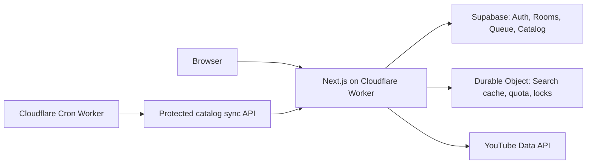

# แผนย้ายระบบไป Cloudflare Workers Free

## เป้าหมาย

ย้ายแอป full-stack ไป Cloudflare Workers Free โดยคง Next.js, Supabase Auth,
Karaoke rooms, queue และ catalog เดิมไว้

ไม่ใช้ Cloudflare Pages แบบ static export เพราะโปรเจกต์มี Route Handlers,
Supabase auth และ API `/api/*` ที่ต้องใช้ server runtime

## แนวทางเลือก runtime

1. รัน `npx vinext check` เพื่อตรวจความเข้ากันได้กับ Next.js 16.3.6
2. ใช้ Vinext เป็นเป้าหมายหลักสำหรับ Next.js บน Cloudflare Workers
3. หากพบ incompatibility ที่แก้ไม่ได้ ให้ใช้ OpenNext adapter เป็นทางสำรอง
4. รักษา `npm run dev` เดิมไว้สำหรับ local development

เพิ่ม scripts สำหรับ Workers:

- `dev:vinext`
- `build:vinext`
- `preview:vinext`
- `deploy`

## ย้าย SQLite search state ไป Durable Object

แทนที่ `src/lib/youtube-search-store.ts` ซึ่งปัจจุบันใช้ `node:sqlite`,
`node:fs` และไฟล์ `.data/youtube-search.sqlite`

สร้าง Durable Object แบบ SQLite หนึ่งตัวสำหรับ state ส่วนกลาง โดยเก็บข้อมูล
เดิมครบถ้วน:

- `search_cache`
- `search_budget`
- `search_leases`
- `search_clients`
- `search_outages`

ปรับ API ของ storage ให้เป็น asynchronous แล้วแก้ผู้เรียก:

- `src/lib/youtube.ts`
- `src/app/api/search/route.ts`

Durable Object ทำให้ quota, lease และ client rate limit ถูกประมวลผลแบบ
เรียงลำดับ จึงป้องกันการใช้ YouTube quota เกินได้เหมือน SQLite เดิม

ไม่ต้องย้ายข้อมูลใน `.data` เพราะเป็น cache และ counter ที่เริ่มใหม่ได้
ข้อมูลถาวร ได้แก่ catalog, rooms, queue และผู้ใช้ อยู่ใน Supabase อยู่แล้ว

## ย้าย catalog maintenance ไป Cloudflare Cron

นำ timer ออก:

- `src/instrumentation.ts`
- `src/lib/catalog-maintenance.ts`

สร้าง Cron Worker และ protected endpoint สำหรับ catalog sync โดยแบ่งงานเป็น
หน่วยเล็ก เช่น playlist หนึ่งหน้า หรือ video detail หนึ่ง batch ต่อ invocation

ใช้ `karaoke_catalog_sync` และ lock ใน Supabase ที่มีอยู่แล้วเพื่อเก็บ cursor
และให้การ sync หยุดแล้วทำต่อรอบถัดไปได้

การแบ่งงานจำเป็นสำหรับ Workers Free เพราะมี CPU 10 ms ต่อ invocation แม้เวลา
รอ network request จะไม่คิดเป็น CPU

## ปรับ API ให้เข้ากับ Workers

| จุดเดิม | การเปลี่ยน |
| --- | --- |
| `node:sqlite`, `node:fs`, `node:path` | เอาออก ใช้ Durable Object |
| `node:crypto` | ใช้ Web Crypto `crypto.randomUUID()` |
| `export const runtime = 'nodejs'` | เอาออกจาก API routes |
| `process.env` ฝั่ง server | อ่านจาก Cloudflare Worker bindings |
| Timer รายวัน | Cloudflare Cron |
| `YOUTUBE_SEARCH_DB_PATH` | เลิกใช้ |
| `KARAOKE_CATALOG_AUTO_SYNC` | เลิกใช้ |

## Environment variables

ตั้งเป็น Cloudflare secrets:

- `SUPABASE_SERVICE_ROLE_KEY`
- `YOUTUBE_API_KEY`
- `CRON_SECRET`

ตั้งเป็น build/runtime variables:

- `NEXT_PUBLIC_SUPABASE_URL`
- `NEXT_PUBLIC_SUPABASE_ANON_KEY`
- `NEXT_PUBLIC_APP_URL`

ห้ามเก็บ service role key ใน Git, `wrangler.jsonc` หรือ client bundle

เพิ่ม Cloudflare production และ preview domains ใน Supabase Auth Redirect URLs

## การทดสอบและ deploy

1. ทดสอบ Durable Object: cache hit/miss, quota, lease และ rate limit
2. ทดสอบ `/api/search`, `/api/catalog` และ `/api/rooms` ใน Workers local preview
3. ทดสอบ Cron sync หนึ่งงานย่อยและตรวจ cursor ใน Supabase
4. Deploy preview ไป `workers.dev`
5. ทดสอบ Google login, callback, room, queue realtime และ YouTube search
6. ตั้ง `NEXT_PUBLIC_APP_URL` เป็น production domain แล้ว deploy production

## ข้อจำกัดของ Free plan

- Workers Free: 100,000 requests ต่อวัน
- Durable Objects แบบ SQLite ใช้ได้บน Free plan
- Cron triggers: สูงสุด 5 รายการต่อ account
- CPU: 10 ms ต่อ HTTP request และ Cron invocation

ออกแบบ catalog sync เป็นงานย่อยและติดตาม usage ก่อนเปิดให้ผู้ใช้จำนวนมาก

## แหล่งอ้างอิง

- [Cloudflare Next.js on Workers](https://developers.cloudflare.com/workers/framework-guides/web-apps/nextjs/)
- [Cloudflare OpenNext adapter](https://developers.cloudflare.com/workers/framework-guides/web-apps/opennext/)
- [Cloudflare Durable Objects](https://developers.cloudflare.com/durable-objects/)
- [Cloudflare Cron Triggers](https://developers.cloudflare.com/workers/configuration/cron-triggers/)
- [Cloudflare Workers limits](https://developers.cloudflare.com/workers/platform/limits/)
