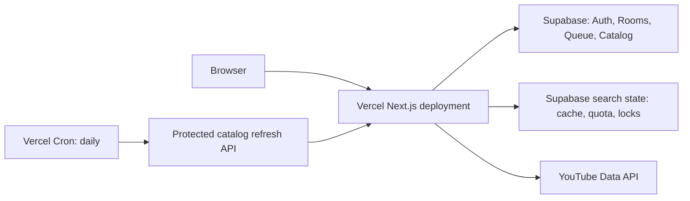

# แผนย้ายระบบไป Vercel

## เป้าหมาย

Deploy โปรเจกต์ Next.js ไป Vercel โดยใช้ Supabase เป็น persistent state ทั้งหมด
และตัดการพึ่งพา filesystem กับ background timer ออก

Vercel ตรวจพบ Next.js และใช้ `next build` ได้โดยไม่ต้องมี adapter เพิ่มเติม

## ปัญหาที่ต้องแก้ก่อน deploy

1. `src/lib/youtube-search-store.ts` ใช้ `node:sqlite`, `node:fs` และไฟล์
   `.data/youtube-search.sqlite` ซึ่งไม่ใช่ persistent storage บน Vercel
2. `src/instrumentation.ts` เริ่ม background timer ที่คาดหวัง Node server
   ทำงานต่อเนื่อง แต่ Vercel Functions ไม่มี process ถาวร
3. Vercel Hobby Cron ทำงานได้สูงสุดวันละครั้ง และเวลา trigger อาจคลาดเคลื่อน
   ภายในชั่วโมงที่ตั้งไว้

## สถาปัตยกรรมเป้าหมาย

คง Supabase เป็นฐานข้อมูลเดียวของแอป:

- Auth, rooms และ queue ใช้ Supabase เดิม
- `karaoke_catalog` และตาราง catalog อื่นใช้ Supabase เดิม
- ย้าย search cache, daily budget, leases, client rate limit และ upstream outage
  จาก local SQLite ไป Supabase Postgres

ไม่ใช้ Vercel filesystem, Vercel KV หรือ in-memory `Map` เป็นแหล่งข้อมูลถาวร

## Phase 1: สร้าง Supabase migration สำหรับ search state

เพิ่ม migration ใหม่ใต้ `supabase/migrations/` ด้วยตาราง:

- `karaoke_search_cache`
  - `query` primary key
  - `payload` JSONB
  - `updated_at`, `expires_at`
- `karaoke_search_budget`
  - `day` primary key
  - `used`
- `karaoke_search_leases`
  - `query` primary key
  - `token`, `expires_at`
- `karaoke_search_clients`
  - `client` primary key
  - `last_request`
- `karaoke_search_outages`
  - `day` primary key

เปิด RLS และ revoke สิทธิ์จาก `anon` และ `authenticated`; อนุญาตเฉพาะ
`service_role` เช่นเดียวกับ catalog tables เดิม

เพิ่ม RPC functions เพื่อให้การอัปเดต atomic:

- `karaoke_search_reserve(query, client, daily_limit)`
  - ลบ cache และ lease ที่หมดอายุ
  - ตรวจ upstream outage
  - ตรวจ rate limit ของ client
  - เพิ่ม quota เฉพาะเมื่อยังไม่ถึง limit
  - สร้าง lease และคืน token
- `karaoke_search_release(query, token)`
- `karaoke_search_get_budget(daily_limit)`
- `karaoke_search_mark_outage()`

ใช้ transaction ภายใน function เพื่อป้องกัน request พร้อมกันใช้ YouTube quota เกิน

## Phase 2: แทนที่ local SQLite repository

แก้ `src/lib/youtube-search-store.ts` ให้เป็น async Supabase repository:

- ลบ imports `node:sqlite`, `node:fs`, `node:path`, `node:crypto`
- ใช้ `catalogRest` หรือ server-only Supabase client เพื่อเรียก REST/RPC
- คง interface ทางธุรกิจเดิม ได้แก่ read cache, write cache, reserve, release,
  get budget และ mark outage

ปรับผู้เรียกให้ await repository:

- `src/lib/youtube.ts`
- `src/app/api/search/route.ts`

ปรับ tests เดิมที่จำลอง SQLite ให้ทดสอบ repository contract และ Supabase RPC
แทน

ไฟล์ `.data/youtube-search.sqlite` ไม่ต้องย้าย เพราะเก็บเพียง cache และ counter
ที่สร้างใหม่ได้

## Phase 3: เปลี่ยน catalog maintenance เป็น Vercel Cron

ลบการเริ่ม timer จาก:

- `src/instrumentation.ts`
- `src/lib/catalog-maintenance.ts`

สร้าง route `src/app/api/internal/catalog-sync/route.ts`:

1. ตรวจ `Authorization` ให้เท่ากับ `Bearer ${CRON_SECRET}`
2. เรียก catalog refresh แบบ bounded หนึ่งงานย่อย
3. ใช้ lock และ cursor ใน `karaoke_catalog_leases` กับ `karaoke_catalog_sync`
   ที่มีอยู่แล้ว
4. คืนผลลัพธ์ที่บันทึกลง log ได้

แยก `syncOfficialCatalog()` เป็น `syncOfficialCatalogStep()` เพื่อให้หนึ่ง request
ทำเพียง playlist page เดียว หรือ video-detail batch เดียว และสามารถ resume ได้

เพิ่ม `vercel.json` ที่กำหนด cron path `/api/internal/catalog-sync` วันละครั้ง
ตามข้อจำกัด Vercel Hobby

การนำเข้า catalog ครั้งแรกให้รัน `npm run catalog:sync` จากเครื่อง local ที่มี
environment variables ครบก่อน จากนั้น Vercel Cron จะทำหน้าที่ refresh แบบจำกัด
ต่อวัน การ sync ครบทั้งช่องแบบเร็วต้องใช้ Pro หรือ external scheduler

Vercel ส่ง `CRON_SECRET` เป็น Authorization header อัตโนมัติเมื่อเรียก cron
endpoint แต่ route ต้องตรวจ header เอง

## Phase 4: ตั้งค่า Vercel

ตั้งค่า Project:

- Framework: Next.js auto-detected
- Build command: ค่า default `next build`
- Node.js: 24.x
- Production branch: `main`

ตั้ง Environment Variables ทั้ง Production และ Preview:

| Variable | ประเภท |
| --- | --- |
| `NEXT_PUBLIC_SUPABASE_URL` | public build-time variable |
| `NEXT_PUBLIC_SUPABASE_ANON_KEY` | public build-time variable |
| `NEXT_PUBLIC_APP_URL` | public build-time variable |
| `SUPABASE_SERVICE_ROLE_KEY` | secret ฝั่ง server |
| `YOUTUBE_API_KEY` | secret ฝั่ง server |
| `CRON_SECRET` | secret สำหรับ cron route |

ลบการตั้งค่าที่เลิกใช้:

- `YOUTUBE_SEARCH_DB_PATH`
- `KARAOKE_CATALOG_AUTO_SYNC`

`NEXT_PUBLIC_*` ถูกฝังใน client bundle ในขั้น build จึงต้องตั้งค่าให้ถูกต้องก่อน
deploy และ redeploy ทุกครั้งที่เปลี่ยนค่า

เพิ่ม production domain และ preview domain ที่ใช้ทดสอบใน Supabase Auth Redirect URLs
หลัง Vercel สร้าง deployment URL แล้วตั้ง `NEXT_PUBLIC_APP_URL` เป็น production domain

## Phase 5: ทดสอบและเปิดใช้งาน

1. รัน Supabase migration บน staging project
2. ทดสอบ search cache hit/miss, quota, lease, rate limit และ outage handling
3. ทดสอบ `/api/search`, `/api/catalog` และ `/api/rooms` ด้วย Vercel preview
4. ทดสอบ Google OAuth callback และ Supabase realtime queue
5. ทดสอบ catalog refresh route ด้วย Authorization header ที่ถูกต้อง
6. ตรวจ Vercel Cron logs หลัง scheduled invocation
7. Deploy production และตั้ง `NEXT_PUBLIC_APP_URL` เป็น domain จริง

## Acceptance criteria

- `npm run build` ผ่านด้วย environment ของ Vercel
- หน้าแรกไม่เกิด `Invalid supabaseUrl`
- Search ทำงานแม้ Vercel Function ถูก cold start
- quota, client rate limit และ duplicate search lease ยังถูกบังคับข้ามทุก function instance
- rooms, queue และ OAuth ทำงานบน preview และ production
- catalog refresh ทำงานซ้ำได้โดยไม่เขียนข้อมูลซ้ำหรือชนกัน

## ข้อจำกัด Vercel Hobby

- Cron job ทำได้สูงสุดวันละครั้ง และการเริ่มงานคลาดเคลื่อนได้ภายในชั่วโมงนั้น
- Vercel Functions มี filesystem สำหรับ scratch เท่านั้น จึงห้ามใช้เป็นที่เก็บ SQLite
- Function duration สูงสุด 60 วินาทีบน Hobby จึงต้องแบ่ง catalog refresh เป็นงานย่อย

## แหล่งอ้างอิง

- [Vercel Next.js deployment](https://vercel.com/kb/guide/nextjs-on-vercel-vs-netlify)
- [Vercel Functions runtime](https://vercel.com/docs/functions/runtimes)
- [Vercel Cron Jobs](https://vercel.com/docs/cron-jobs)
- [Vercel Cron security and concurrency](https://vercel.com/docs/cron-jobs/manage-cron-jobs)
- [Vercel Cron usage and Hobby limits](https://vercel.com/docs/cron-jobs/usage-and-pricing)
- [Vercel environment variables](https://vercel.com/docs/environment-variables)
